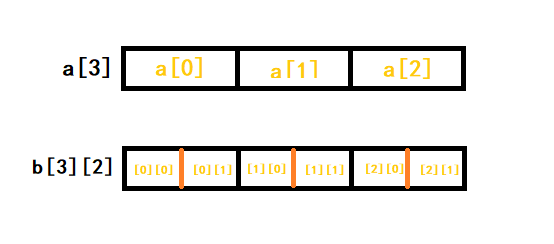

# 指针

## 1. 一维数组

### 🎀1.1 初始化

#### 数值初始化

```c
// 完整初始化
int a[] = {1, 2, 3, 4, 5};
int b[5] = {1, 2, 3, 4, 5};

// 不完整初始化
int c[5] = {1, 2, 3};
```

- 完整初始化可以在```[]```中不写数组长度，编译器自动计算
- 不完整初始化中只初始化前几个元素的值，后面的元素初始化为```0```
- 初始化：
> 1. 局部的数组如果不初始化，值为随机未定义；<br>
> 2. 静态数组在程序开始执行前已初始化，未避免每次的重新初始化，可声明为```static```

#### 字符数组初始化

```c
// 字符数组
char message[] = {'h', 'e', 'l', 'l', 'o', 0};
// 等价于
char message[] = "hello"; // 推荐使用

// 字符常量
char *message1 = "hello";
```

### 🎀1.2 指针与下标的联系

```c
array[subscript]
*(array + subscript)
```

- 除了优先级之外，下标引用与间接访问完全相同
- 下标引用可以作用于任意的指针，而不仅仅是数组名


### 🎀1.3 指针与数组名区别

- 说明
> 1. 指针：<font color="blue">**指向一个内存地址**</font>，类型由所指向内存存放的数据类型决定
> 2. 数组名：是一个指针常量，指向数组中第一个元素，也就是<font color="blue">**数组第一个元素的地址**</font>，类型由所指向的元素类型决定

- 内存分配
> 1. 指针：声明一个指针变量，只为指针本身保留内存空间，它为自动变量
> 2. 数组名：声明一个数组，则会根据数组元素数量保留内存空间，然后再创建数组名

- 计算
> 1. 指针：是变量，可以移动运算
> 2. 数组名：是一个指针常量，不可以更改其值，只有在两种场合中不表此意：
> > - ```sizeof(数组名)```，结果为整个数组所占字节数
> > - ```&数组名```，返回一个指向数组的指针，而不是一个指向指针常量的指针

- 赋值复制
> 1. 指针：一个指针可以给另一个指针赋值
> 2. 数组名：一个数组名赋值给另一个数组名，不能实现数组中元素全部复制给另一个数组

### 🎀1.4 数组名作为函数参数传入

```c
//函数形参，以下两条语句等价：
int strlen(char *string);
int strlen(char string[]);
```

- 上面两个中使用指针更为准确
> 1. 形参使用**指针**形式：因为数组名实际为一个<font color = CC00FF>**指针常量**</font>，所以形参使用指针接收
> 2. 形参使用**数组**形式：函数并不为数组形参分配内存，所以不需要指明数组中数组元素数量，<font color = CC00FF>**实质传递的是指向数组第一个元素的指针**</font>

## 2. 多维数组

### 🎀2.1 存储方式

```c
int a[3];
int b[3][2];
int c[3][2][4];
```

- 数组中的元素是顺序存储的，称之为“行主序”
> 
- 多维数组要从左往右层层看：
> - 数组```b[3][2]```可以看作是数组元素个数为```3```，元素内容为（一个包含```2```个```int```元素的一维数组）的一维数组
> - 数组```c[3][2][4]```可以看作是数组元素个数为```3```，元素内容为（一个数组元素个数为```2```，元素为（一个包含```4```个```int```元素的一维数组）的一维数组）的一维数组

### 🎀2.2初始化

```c
// 直接没有任何区分的写
int a[2][3] = {0, 1, 2, 3, 4, 5};

// 区分每一维数组元素
int a[2][3] = 
{
    {0, 1, 2},
    {3, 4, 5}
};

// 部分初始化，为初始化部分为0
int a[2][3] = 
{
    {0, 1},
    {3}
};
```

### 🎀2.3 数组名、下标与指针

```c
int matrix[3][10];
```

#### 数组名

- 多维数组的数组名是：指向第一维元素的指针常量，而第一维元素实际上是一个数组
  
#### 下标

- 下标表示多维数组第二行第3列的元素：```matrix[1][2]```
- 数组名表示多维数组第二行第3列的元素：```*(*(matrix + 1) + 2)```

表达式 | 类型 | 说明
--- | --- | --- 
```matrix``` | ```int (*)[10]``` | 指向多维数组第一维元素的指针常量，是一个指向整型数组的指针
```*matrix``` | ```int *``` | 间接方法多维数组的第一维元素，由于该元素是一个一维数组，所以它的类型为```int *```
```*(matrix + 1)``` | ```int *``` | 间接方法多维数组的第二维元素。仍然是一个一维数组，指向该一维数组的第一个元素
```*(matrix + 1) + 2``` | ```int *``` | 计算第3个元素位置
```*(*(matrix + 1) + 2)``` | ```int ``` | 间接访问取第3个元素的值

#### 指针

```c
int matrix[3][10];
```

- 指向多维数组的指针

```c
int (*p)[10] = matrix; 
```

> **因为数组名表示的是指向第一维元素（10个元素的一维数组）的指针，所以当定义等价的指针时，必须写清楚p是一个指向拥有10个整型元素的数组的指针**

- 指向第一个整型元素的指针

```c
int * p1 = &matrix[0][0]; // 1
// 或
int *p1 = matrix[0]; // 2 
```

> 1. 直接定位到第一个元素，求其地址
> 2. 多维数组的第一维元素就是指向该一维数组的指针

### 🎀2.4 作为函数参数

```c
int matrix[3][10];
func(matrix);

void func(int (*mat)[10]); // 指针形式
void func(int mat[][10]); // 数组形式
```

- 对比，下面是完全不相同的

```c
void func(int **mat); // 数组形式
```

> 1. ```int **mat```：指向整型指针的指针
> 2. ```int (*mat)[10]```：指向整型数组的指针

## 3. 指针数组

- 数组元素内容为指针

```c
const char *country[] = {
    "China",
    "France",
    "England",
    "Canada",
    NULL
};
```

- 表末添加NULL指针，有助于检测表的结尾

```c
for(c = country; *c != NULL; c++)
```


