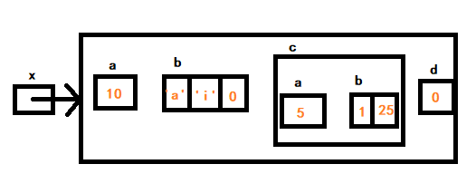
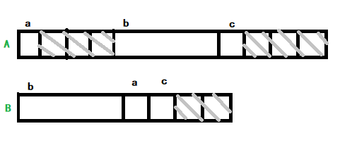

# 结构和联合

## 1. 结构

- 在```C```的基本数据类型中，聚合类型能够同时存储超过一个的单独数据，包括数组和结构两种。

### 🍒1.1 结构声明

#### 1.1.1 最简单的声明

- 关键字```struct```

```c
struct {  // (1)
    int a;
    char b;
    float c;
} x;

struct {  // (2)
    int a;
    char b;
    float c;
} y[20], *z;

z = &x;  // 编译不通过 (3)
```

- 上面```struct{};```是一个自定义的聚合类型，类似```int```类型
- ```struct{} x;```相当于声明了一个```x```变量；```struct{} y[20], *z;```相当于声明了一个数组和一个指针变量
- ```struct{};```的成员列表中内容虽然一样，但是```x```和数组```y```中元素、```z```指向的变量，编译器不认为是同一个类型，所以```(3)```的赋值不成立

#### 1.1.2 加入结构标签

- “标签”允许为成员列表提供一个名字，便于声明相同类型的变量

```c
struct SIMPLE { 
    int a;
    char b;
    float c;
};

struct SIMPLE x;
struct SIMPLE y[20], *z;
z = &x; // 成立
```

#### 1.1.3 typedef的加入

- ```typedef```为结构创建新的类型名

```c
typedef struct { 
    int a;
    char b;
    float c;
} Simple;

Simple x;
Simple y[20], *z;
z = &x; // 成立
```

- 上述效果几乎相同，但是区别在于：```Simple```现在是类型名而不是结构标签

### 🍒1.2 结构的初始化

- 使用```{}```
- 如果初始列表的值不够，则使用缺省值初始化

```c
struct INIT_EX {
    int a;
    short b[10];
    Simple c;
} x = {
    10, 
    {1, 2, 3, 4},
    {25, 'x', 1.9}
};
```

### 🍒1.3 结构指针

#### 1.3.1 结构自引用

- 变量在声明的时候会根据类型分配内存，所以如果结构中有自己类型的变量，得用指针引用，因为指针的大小是固定的

```c
struct SIMPLE { 
    int a;
    char b;
    float c;
    struct SIMPLE d; // 错误
};

struct SIMPLE { 
    int a;
    char b;
    float c;
    struct SIMPLE *d; // 正确
};
```

#### 1.3.2 不完整的声明

- 两个结构中包含了各自的结构作为成员

```c
// 因为B还没有声明，但是A中需要使用，所以就进行了不完整的声明
struct B; 

struct A { 
    struct *B;
};

struct B { 
    struct *A;
};
```

### 🍒1.4 结构成员的访问

#### 1.4.1 结构成员访问运算符

```c
Simple x, *z;

(*z).c; // 等价于
z->c;
```

- 标量使用```*```
- 指针使用```->```

#### 1.4.2 结构内成员的类型

```c
typedef struct {
    int a;
    short b[2];
}EX2;

typedef struct EX {
    int a;
    char b[3];
    EX2 c;
    struct EX *d;
} Ex;
```



成员 | 类型 | 指针赋值
--- | --- | ---
```a``` | ```int``` | ```int *pa = &x->a;```
```b``` | ```char *``` | ```char *pb = x->b;```
```c``` | ```EX2``` | ```EX2 *pex2 = &x->c;```
```d``` | ```EX *``` | ```EX *pex = x->d;```

- 运算符优先级：```->``` 高于 ```&```
- 运算符优先级：```->``` 高于 ```.``` 高于 ```*```

### 🍒1.5 结构的存储分配

```c
struct A {
    char a;
    int b;
    char c;
};

struct B {
    int b;
    char a;
    char c;
};
```

- 编译器按照成员列表声明的顺序给每个成员分配内存
- 边界对齐的问题，让对边界要求最严格的成员首次出现，最弱的成员最后出现，可以最大限度的减少因边界对齐带来的空间损失



### 🍒1.6 作为函数参数

- 通常来说，传结构的指针比结构本身更效率

## 2. 位段

- 声明类似结构
- 不同之处：
> 1. 成员是一个或多个位的字段，这些不同长度的字段实际上存储于一个或多个整型变量中
> 2. 位段成员必须声明为int、signed int或unsigned int类型
> 3. 成员名后面是一个冒号和一个整数，整数指定该位段所占的位的数目

```c
struct CHAR {
    unsigned ch : 7;
    unsigned font : 6;
    unsigned size : 19
}; // 32位
```

- 使用位段方便通过移位和屏蔽实现任务，唯一优点就是简化源代码

## 3. 联合

### 🍒3.1 联合声明与内存分配

```c
union {
    int i;
    float f;
    char *s;
} value;
```

- 所有成员引用的是内存中相同的位置
- 联合的长度是它最长成员的长度
- 仅由的区别：在于每个成员的类型决定如何解释存放在相同位置处的数据

### 🍒3.2 初始化

- 初始化必须是联合第1个成员的类型
- 通过{}初始化

```c
union {
    int i;
    float f;
    char *s;
} x = { 5 };
```


