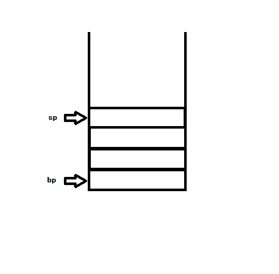
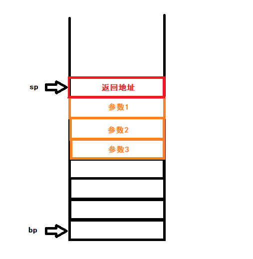
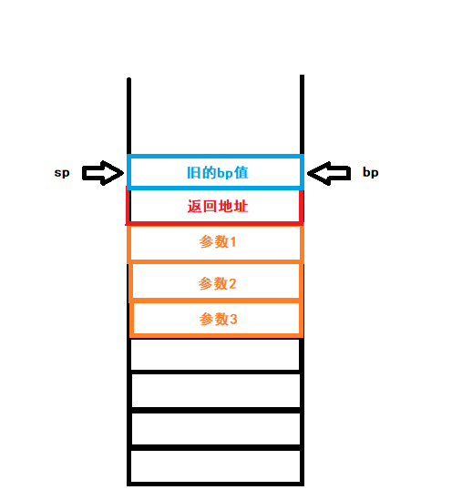
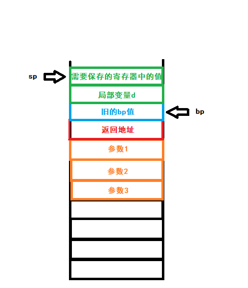
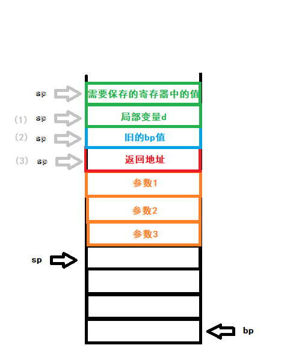

# 运行时环境

## 1. 函数调用对应汇编指令

- 函数调用分为：函数序、函数体、函数跋

```c
int i1 = 1;
register int i3 = 3;
i2 = func1(10, i1, i3);

int func1(int a, int b, register int c)
{
    int d;
    d = b - 6;
    return a + b + c;
}
```

- 🔸 
- 函数调用前
- 栈帧的地址从高到低，压栈往地址低的地方



- 🔸 
- 函数调用按照从右向左传入参数压入栈
- 保存函数调用完后的返回地址压入栈



- 🔸 函数序
- 跳转入函数，保存bp的值
- 将sp赋值到bp



- 🔸 函数体
- 栈中压入函数中的局部变量
- 然后保存寄存器中的值于栈顶



- 🔸 函数跋
- 恢复以前被保存的寄存器中的值
- 恢复bp的值
- 将返回地址弹出，函数返回
- sp按传入参数所占内存下移



